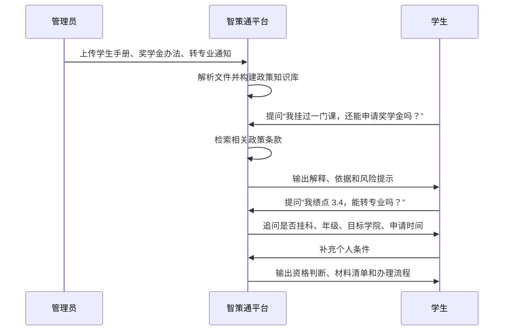
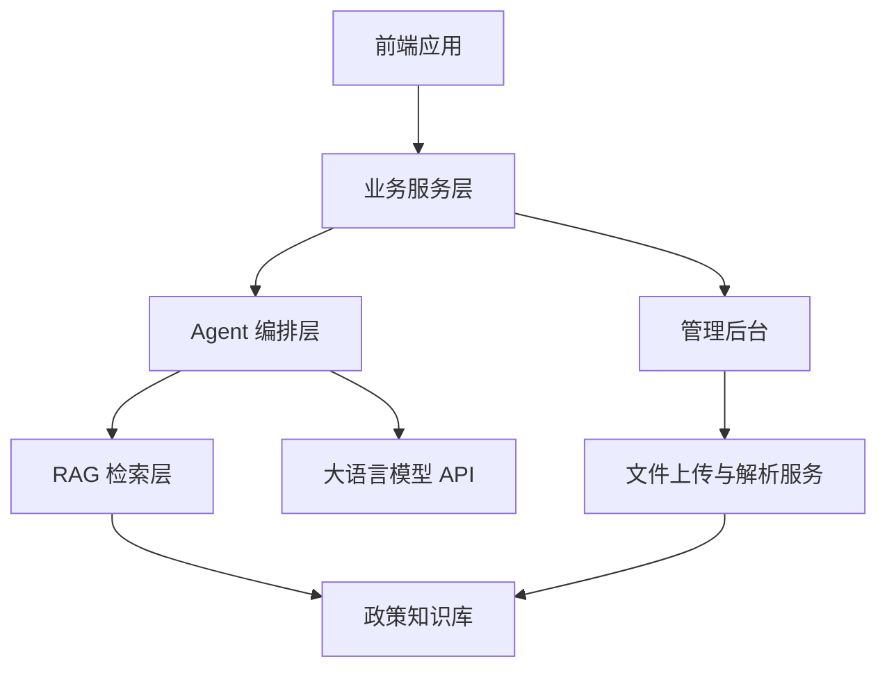

# 智策通：产品需求梳理

## 一、项目标题

**智策通：面向多域政策服务场景的智能体化政策理解与精准服务平台**

项目定位：

> 以高校政策服务为首个落地样板，面向城市青年、企业政策和政务服务等多域场景扩展，构建一个能够完成政策理解、条件判断、流程生成和可信溯源的智能体化政策服务平台。

## 二、当前阶段核心结论

本项目不应被定义为普通的“政策问答系统”，而应被定义为：

> 基于多智能体协同的政策理解、资格判断与办事路径生成平台。

核心目标不是简单回答“政策写了什么”，而是帮助用户完成完整服务闭环：

比赛阶段建议采用“一核四域”的产品策略：

- **一核**：高校政策智能服务，作为可运行 Demo 的首个落地场景。
- **四域**：高校政策、城市青年政策、企业政策、政务服务，作为平台化扩展方向。

这样既能保证项目有真实落地场景，又能在比赛表达中体现技术创新、社会价值、商业价值和政务价值。

## 三、参赛目标

### 3.1 比赛定位

本项目面向研究生创新产品技术应用类比赛，目标是冲击国家级奖项。

因此项目需要同时具备：

1. **技术创新性**
   体现大语言模型、RAG、多智能体协同、政策知识库、条件推理与可信溯源等技术能力。

2. **应用落地性**
   至少具备一个可运行 Demo，而不是停留在概念方案。

3. **社会价值**
   降低普通用户理解政策、使用政策和办理事项的门槛。

4. **政务价值**
   提升公共服务效率，减少重复咨询，推动政策服务精准触达。

5. **商业价值**
   未来可面向高校、园区、企业服务机构、政务大厅等组织提供平台化服务。

### 3.2 成果形态

比赛阶段建议呈现为：

- 一套完整产品方案
- 一个可运行演示系统
- 一份项目申报书或商业计划书
- 一套路演 PPT
- 若时间允许，可补充技术论文式说明材料

## 四、落地路径

### 4.1 总体落地顺序

项目落地建议按照以下路径逐步扩展：

### 4.2 第一阶段：高校政策服务

高校政策是最适合作为 V1.0 的首个场景。

原因：

- 政策文件相对容易获取
- 学生痛点真实且强烈
- 演示案例清晰
- 数据规模可控
- 用户角色完整，既有学生端，也有管理端
- 可自然扩展到城市青年、企业和政务服务场景

首批政策范围建议包括：

- 奖学金
- 助学金
- 转专业
- 保研
- 毕业要求
- 请假
- 处分
- 学籍管理

### 4.3 数据来源

第一阶段可先使用手动上传方式，不必优先开发自动爬虫。

建议优先导入以下西安电子科技大学相关政策材料：

- 学校学生手册
- 奖学金评定办法
- 助学金相关规定
- 转专业通知
- 保研政策
- 毕业要求文件
- 学籍管理办法
- 请假与处分相关文件

后续版本再考虑自动爬取学校官网、教务处网站、学生处网站和通知公告。

## 五、目标用户与核心痛点

### 5.1 用户分层

虽然项目最终面向多类用户，但 V1.0 阶段应明确主次。

| 用户类型 | 阶段定位 | 核心需求 |
|---|---|---|
| 学生 | 第一核心用户 | 找政策、理解政策、判断自己是否符合条件 |
| 辅导员 | 第二核心用户 | 减少重复答疑，快速查询政策依据 |
| 教务老师 | 第二核心用户 | 辅助解释学籍、转专业、毕业等政策 |
| 学生处/管理人员 | 管理端用户 | 上传政策、维护知识库、查看热点问题 |
| 青年人才 | 二期扩展用户 | 人才补贴、租房补贴、落户政策匹配 |
| 企业负责人 | 三期扩展用户 | 税收优惠、项目申报、补贴政策匹配 |
| 政务服务用户 | 四期扩展用户 | 政策咨询、材料准备、办事流程指引 |

### 5.2 核心痛点

当前用户最核心的痛点包括：

1. **找不到政策**
   政策分散在官网、通知、PDF、附件和办事指南中，用户不知道去哪找。

2. **看不懂政策**
   政策语言正式、条款复杂，普通用户很难快速理解关键含义。

3. **不知道自己是否符合条件**
   用户真正关心的是“我能不能申请”“我有没有资格”“我还缺什么条件”。

4. **不知道下一步怎么办**
   用户需要材料清单、办理流程、截止时间、负责部门和注意事项。

## 六、产品首页设计建议

### 6.1 首页不建议只做聊天框

如果首页只是一个聊天输入框，容易被评委认为是“套壳式 ChatGPT”或普通 RAG 问答系统，产品辨识度不够。

建议首页设计为：

> 政策服务工作台

核心表达：

> 说出你的情况，智策通帮你找到政策依据、判断适用条件、生成办理路径。

### 6.2 首页核心入口

首页建议设置四个主要入口：

| 入口 | 面向问题 | 示例 |
|---|---|---|
| 我要问政策 | 用户想理解某个政策 | “挂科还能申请奖学金吗？” |
| 我要判断资格 | 用户想知道自己能不能办 | “我绩点 3.4，可以转专业吗？” |
| 我要办理事项 | 用户想按事项查看流程 | 奖学金、转专业、保研、毕业、请假 |
| 管理入口 | 管理员维护政策知识库 | 上传文件、查看热门问题、维护标准答案 |

### 6.3 推荐首屏结构

首屏可以由以下模块组成：

1. 顶部导航：智策通、政策库、事项中心、管理后台
2. 中央主入口：自然语言输入框
3. 快捷事项卡片：奖学金、助学金、转专业、保研、毕业、请假、处分、学籍
4. 智能服务按钮：问政策、判资格、列材料、走流程
5. 可信说明：回答基于已上传政策文件，并提供出处引用

## 七、V1.0 功能需求

### 7.1 学生端功能

学生端是 Demo 的主要展示入口。

必须支持：

1. **自然语言政策问答**
   用户可以直接输入问题，系统基于政策知识库回答。

2. **政策出处引用**
   回答中展示来源文件、条款位置、生效时间或发布部门。

3. **资格判断**
   系统根据用户描述判断是否符合政策条件。

4. **主动追问**
   当用户信息不足时，Agent 主动追问关键条件。

5. **材料清单生成**
   系统根据政策要求整理用户需要准备的材料。

6. **办理流程生成**
   系统输出办理步骤、负责部门、时间节点和注意事项。

7. **风险提示**
   对不确定、条件缺失或政策可能有歧义的问题进行提示。

### 7.2 管理端功能

管理端用于体现项目的落地性和可运营性。

必须支持：

1. **政策文件上传**
   支持上传 PDF、Word 等政策文件。

2. **政策文件管理**
   展示文件名称、政策类型、上传时间、解析状态。

3. **知识库构建**
   对上传文件进行解析、切分、向量化和入库。

4. **热门问题查看**
   统计用户高频咨询问题。

5. **标准答案维护**
   管理员可对重点问题维护官方或半官方回答。

建议支持：

- 政策版本管理
- 文件发布部门维护
- 生效时间与失效时间维护
- 高风险问题人工审核

### 7.3 智能能力需求

系统应具备以下智能能力：

| 能力 | 说明 |
|---|---|
| 文档解析 | 解析 PDF、Word、网页文本等政策材料 |
| 文本切分 | 按章节、条款或语义段落切分政策内容 |
| 向量检索 | 根据用户问题召回相关政策条款 |
| RAG 回答 | 基于检索到的政策片段生成回答 |
| 多轮追问 | 当用户条件不足时主动补充询问 |
| 条件推理 | 判断用户条件与政策要求的匹配程度 |
| 流程规划 | 生成材料清单、办理步骤和时间节点 |
| 可信校验 | 检查回答是否具有政策依据 |

## 八、MVP 演示闭环

比赛 Demo 应优先展示一个完整闭环，而不是展示大量分散功能。

### 8.1 推荐演示链路

### 8.2 推荐演示案例

案例一：奖学金政策问答

- 用户问题：我挂过一门课，还能申请奖学金吗？
- 展示能力：政策检索、通俗解释、出处引用、风险提示。

案例二：转专业资格判断

- 用户问题：我大一绩点 3.4，想转计算机专业，可以吗？
- 展示能力：主动追问、条件判断、适用性分析、流程生成。

案例三：管理员上传政策

- 管理员操作：上传学生手册、奖学金评定办法、转专业通知。
- 展示能力：文件解析、知识库构建、政策文件管理、热门问题统计。

## 九、可信机制

政策类产品必须强调可信机制，否则容易被质疑“AI 一本正经地胡说”。

### 9.1 回答原则

系统回答应遵循以下原则：

1. 优先基于已上传政策文件回答。
2. 回答中尽量附带政策来源。
3. 可以进行有限推断，但必须明确区分“政策原文依据”和“AI 推断建议”。
4. 信息不足时，不直接下绝对结论。
5. 对高风险事项提示以学校或主管部门最终解释为准。

### 9.2 不确定问题处理方式

当系统无法确定答案时，应采用兜底策略：

> 根据当前已上传政策文件，暂未检索到能够直接确认该问题的明确条款。以下是基于相关政策内容的推断，建议你进一步咨询对应负责部门确认。

输出结构建议为：

- 已知依据
- 无法确定的原因
- AI 推断
- 建议咨询部门
- 需要补充的信息

### 9.3 权威性设计

系统应尽量展示：

- 文件名称
- 发布部门
- 发布日期
- 生效时间
- 条款编号
- 原文片段
- 文件版本

## 十、技术路线建议

### 10.1 V1.0 技术架构

### 10.2 推荐技术模块

1. **前端**
   学生端、管理端、问答界面、事项中心。

2. **后端**
   用户会话、文件管理、问答接口、知识库管理。

3. **文档解析**
   PDF/Word 文本抽取、分段、元数据提取。

4. **知识库**
   文档切片、向量化、语义检索。

5. **智能体编排**
   问题理解、检索、追问、判断、流程生成、风险校验。

6. **模型服务**
   调用大语言模型完成理解、生成和推理。

### 10.3 多智能体分工

| Agent | 职责 |
|---|---|
| 政策解析 Agent | 将上传文件解析为结构化条款 |
| 语义检索 Agent | 找到与用户问题相关的政策依据 |
| 政策解释 Agent | 将政策条款转为通俗表达 |
| 条件追问 Agent | 识别缺失条件并主动提问 |
| 资格判断 Agent | 判断用户是否符合政策条件 |
| 流程规划 Agent | 生成材料清单和办理步骤 |
| 风险校验 Agent | 判断回答是否有依据，并提示不确定性 |

## 十一、版本规划

### 11.1 V1.0：高校政策 Demo

目标：

> 做出一个完整、可运行、可演示的高校政策智能助手。

范围：

- 手动上传西电政策文件
- 构建 RAG 知识库
- 支持政策问答
- 支持出处引用
- 支持资格判断
- 支持材料清单与流程生成
- 支持基础管理后台

### 11.2 V1.5：高校管理增强

范围：

- 增加热门问题看板
- 增加标准答案维护
- 增加政策版本管理
- 增加高风险问题人工审核
- 增加辅导员/教务老师辅助查询入口

### 11.3 V2.0：城市青年政策

范围：

- 人才补贴
- 租房补贴
- 落户政策
- 创业扶持
- 就业见习

### 11.4 V3.0：企业政策服务

范围：

- 税收优惠
- 科技项目申报
- 政府补贴
- 资质认定
- 园区政策匹配

### 11.5 V4.0：政务服务协同

范围：

- 政务大厅政策答疑
- 热线辅助问答
- 材料清单生成
- 办事流程指引
- 政策触达与咨询分流

## 十二、比赛表达重点

### 12.1 项目叙事

建议使用以下叙事：

> 政策并不是没有公开，而是普通用户难以理解、难以判断、难以办理。智策通以高校政策服务为首个验证场景，通过大语言模型、RAG 和多智能体协同，将复杂政策文件转化为可问答、可判断、可办理、可追溯的智能服务。

### 12.2 四个升级

路演中重点强调四个升级：

1. 从“政策检索”升级为“政策理解”。
2. 从“通用问答”升级为“个性化资格判断”。
3. 从“文本回答”升级为“办事路径生成”。
4. 从“单一校园工具”升级为“多域政策服务平台”。

### 12.3 推荐金句

> 智策通不是让 AI 代替政策解释权，而是让 AI 帮助用户更高效、更准确地理解官方政策。

> 我们希望让每一份政策文件，都能转化为用户看得懂、用得上、办得成的智能服务。

> 从政策公开到政策可达，从政策可读到政策可用，智策通让政策服务真正走向精准化和智能化。

## 十三、当前待确认问题

后续进入原型设计和开发前，还需要继续确认：

1. 首批 Demo 使用哪些具体政策文件？
2. 是否只做西安电子科技大学，还是加入一两个其他高校作为对比？
3. V1.0 是否需要用户登录？
4. 是否需要区分学生、辅导员、管理员三类权限？
5. 是否使用真实大模型 API，还是本地模型或模拟接口？
6. 文档解析是否优先支持 PDF，Word 是否放到第二阶段？
7. 答案出处展示到“文件级”即可，还是需要展示到“条款级”？
8. 管理后台是否需要热门问题统计图表？
9. 最终 Demo 是 Web 应用、桌面应用，还是网页原型加后端接口？
10. 比赛提交材料是否需要论文格式、商业计划书格式或系统说明书格式？

## 十四、产品经理建议

当前阶段最重要的不是继续扩大范围，而是先把 V1.0 的演示闭环做扎实。

建议优先完成：

1. 管理员上传 3 到 5 份西电政策文件。
2. 系统完成文档解析与 RAG 入库。
3. 学生围绕奖学金、转专业、毕业要求进行自然语言提问。
4. 系统输出政策解释和出处。
5. 系统在信息不足时主动追问。
6. 系统最终生成资格判断、材料清单和办理流程。

只要这个闭环能流畅跑通，项目就具备了较强的比赛展示价值。

最终产品愿景：

> 让政策从“人找文件”转向“服务找人”，让复杂政策真正变成每个人可理解、可判断、可执行的智能服务。
