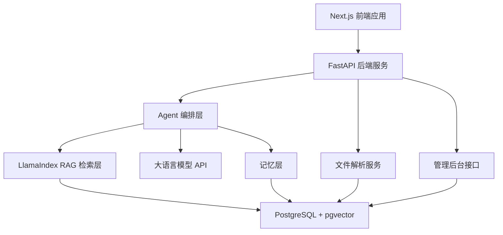
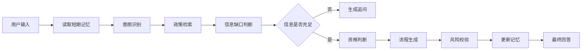

# 智策通 V1.0 技术选型与开发规划

## 一、技术方案总览

智策通 V1.0 最适合采用以下技术路线：

> **Next.js 做高质量 Web 展示，FastAPI 承担后端与 AI 服务，LlamaIndex 负责 RAG 知识库与混合检索，PostgreSQL + pgvector 存储政策条款、向量和结构化记忆，Agent 层先用轻量 Python 编排实现意图识别、政策检索、记忆读取、条件追问、资格判断、流程生成、记忆更新和风险校验。**

该方案的核心思路是：

- 前端要有产品感，适合比赛路演和真实演示。
- 后端要轻量稳定，方便快速开发 AI 服务。
- RAG 要可控，能够清楚展示政策出处。
- Agent 不一开始做得过重，优先保证流程稳定。
- 记忆层要轻量可控，支持短期上下文、事项记忆和长期记忆沉淀。
- 数据库统一存储业务数据、政策条款、向量和结构化记忆，降低部署复杂度。

## 二、总体架构



## 三、技术选型

### 3.1 前端：Next.js

推荐技术：

- Next.js
- TypeScript
- Tailwind CSS
- shadcn/ui
- lucide-react

选择原因：

1. **展示效果好**
   Next.js 适合构建高质量 Web 产品，不像 Streamlit 或 Gradio 那样偏工具化，比赛展示效果更好。

2. **工程化能力强**
   支持组件化、路由、状态管理、接口调用和前后端分离，适合后续扩展。

3. **开发效率高**
   配合 shadcn/ui 和 Tailwind CSS，可以快速搭建专业、干净、有质感的界面。

4. **适合产品化表达**
   可以做出政策服务工作台、问答页、事项中心、管理后台、数据看板等完整产品页面。

前端核心页面：

| 页面 | 功能 |
|---|---|
| 政策服务工作台 | 首页入口，展示问政策、判资格、办事项、管理入口 |
| 智能问答页 | 用户自然语言提问，展示回答、依据和追问 |
| 资格判断页 | 围绕某个事项进行条件补充和适用性判断 |
| 事项中心页 | 展示奖学金、助学金、转专业、保研、毕业等事项 |
| 政策库页面 | 展示已上传政策文件和条款 |
| 管理后台 | 上传政策、查看解析状态、维护标准答案 |
| 热门问题看板 | 展示高频咨询问题和用户关注趋势 |

### 3.2 后端：FastAPI

推荐技术：

- FastAPI
- Pydantic
- SQLAlchemy
- Uvicorn

选择原因：

1. **与 AI 生态兼容**
   Python 是 RAG、文档解析、Embedding、Agent 编排的主流生态，FastAPI 能很好承接这些能力。

2. **接口开发效率高**
   FastAPI 支持自动生成 OpenAPI 文档，方便前后端联调和比赛展示。

3. **轻量灵活**
   相比 Django 更轻，更适合作为 AI 应用后端。

4. **适合后续扩展**
   可以逐步增加用户、权限、任务队列、日志、看板等能力。

后端核心接口建议：

```text
POST /api/documents/upload          上传政策文件
POST /api/documents/{id}/parse      解析政策文件并入库
GET  /api/documents                 获取政策文件列表
GET  /api/documents/{id}            获取政策文件详情

POST /api/chat                      政策智能问答
POST /api/eligibility/check         资格判断
POST /api/workflow/generate         生成材料清单与办理流程

GET  /api/admin/hot-questions       获取热门问题
POST /api/admin/standard-answers    维护标准答案
GET  /api/admin/dashboard           管理端数据看板
```

### 3.3 RAG 框架：LlamaIndex

推荐技术：

- LlamaIndex
- 自定义文档切分
- 混合检索
- 引用出处返回

选择原因：

1. **适合文档知识库场景**
   LlamaIndex 专注于文档索引、知识库检索和 RAG 应用，非常适合政策文件理解。

2. **开发效率较高**
   可以快速完成文档加载、节点构建、索引管理和检索问答。

3. **支持扩展检索策略**
   后续可以增加关键词检索、向量检索、混合检索、重排序等能力。

4. **便于保留出处**
   政策问答必须展示文件名、页码、条款位置，LlamaIndex 可以通过 metadata 保留引用信息。

RAG 推荐流程：


### 3.3.1 政策知识库分层与治理

政策类 RAG 不能只把文件切片后放进向量库，还需要建立分层、版本、生效期、适用范围和附件关系。否则系统很容易出现“检索到过期政策”“学校通用政策和学院细则冲突”“引用附件但找不到附件内容”等问题。

智策通的政策知识库建议按照以下层级组织：

| 层级 | 说明 | 示例 |
|---|---|---|
| 学校通用政策层 | 面向全校适用的基础政策 | 学生手册、学籍管理办法、奖学金评定总则 |
| 部门政策层 | 教务处、学生处、研究生院等部门发布的政策 | 转专业通知、保研工作办法、处分管理规定 |
| 学院政策层 | 某个学院在学校通用政策基础上的细则 | 计算机学院转专业接收条件、通信工程学院保研细则 |
| 事项政策层 | 围绕具体办事事项组织的政策集合 | 奖学金申请、助学金认定、转专业申请 |
| 附件材料层 | 申请表、评分表、材料清单、流程图等附件 | 附件 1 申请表、附件 2 评分细则、附件 3 名单模板 |

政策知识库的每个 chunk 都应该带 metadata，而不是只保存文本和向量。

推荐 metadata 字段：

| 字段 | 说明 |
|---|---|
| document_id | 文件 ID |
| document_title | 文件标题 |
| policy_level | 政策层级，如 school、department、college、case、attachment |
| issuing_department | 发布部门 |
| applicable_scope | 适用范围，如 全校、本科生、研究生、某学院 |
| college | 学院名称，可为空 |
| policy_category | 政策类别，如 奖学金、转专业、毕业、处分 |
| effective_from | 生效时间 |
| effective_to | 失效时间，可为空 |
| publish_date | 发布日期 |
| version | 政策版本 |
| parent_document_id | 上级文件 ID，用于附件或细则关联 |
| attachment_id | 附件 ID |
| attachment_title | 附件标题，如 附件 1：申请表 |
| section_title | 章节标题 |
| article_no | 条款编号 |
| page_no | 页码 |
| source_type | 来源类型，如 pdf、word、web、manual |
| authority_rank | 权威等级，用于冲突处理 |

#### 分层检索策略

用户提问时，系统不应只做一次向量检索，而应先识别用户问题所属的范围，再按层级检索。

推荐流程：

```text
用户问题
→ 识别事项类型
→ 识别用户身份与适用范围
→ 识别学院/部门/时间信息
→ 构造 metadata filter
→ 分层检索学校通用政策、部门政策、学院细则和附件
→ 合并与排序
→ 生成带依据的回答
```

例如用户问：

> 我是计算机学院大一学生，绩点 3.4，想转专业，可以吗？

检索时应优先考虑：

1. 学校层面的转专业通用政策。
2. 教务处发布的当年转专业通知。
3. 计算机学院或目标学院的接收条件。
4. 附件中的申请表、时间安排、名额表或考核细则。

#### 时间有效性处理

政策问答必须处理政策有效期。

推荐规则：

1. 有明确生效时间和失效时间的政策，只在有效期内参与高优先级检索。
2. 如果多个版本同时被检索到，优先使用最新生效版本。
3. 如果检索到过期政策，回答中必须提示“该政策可能已过期”。
4. 如果用户询问历史年份，则允许检索对应年份政策。
5. 如果政策没有明确失效时间，按“当前有效但需提示以最新通知为准”处理。

时间过滤示例：

```text
current_date >= effective_from
AND (effective_to IS NULL OR current_date <= effective_to)
```

#### 学校政策与学院政策冲突处理

高校政策常见情况是学校给出总则，学院给出补充细则。系统需要建立优先级规则：

1. 学院细则不能违背学校通用政策。
2. 在不冲突的情况下，具体学院政策优先于学校通用政策。
3. 同一事项下，新政策优先于旧政策。
4. 同一层级下，发布部门权威等级更高的文件优先。
5. 如果存在明显冲突，系统不直接下绝对结论，而是提示用户咨询对应部门。

推荐回答方式：

```text
学校通用政策规定了基础条件；
目标学院细则在此基础上增加了额外要求；
你的情况需要同时满足两部分要求。
```

#### 附件处理策略

政策文件中的“附件 1”“附件 2”不能只作为普通文本处理，而要建立引用关系。

附件需要独立入库，同时与主文件建立父子关系：

```text
主文件：关于开展 2026 年本科生转专业工作的通知
  ├─ 附件 1：转专业申请表
  ├─ 附件 2：各学院接收计划表
  └─ 附件 3：转专业考核安排
```

附件 chunk 的 metadata 应包含：

```json
{
  "policy_level": "attachment",
  "parent_document_id": "doc_transfer_2026",
  "attachment_id": "att_001",
  "attachment_title": "附件 1：转专业申请表",
  "policy_category": "转专业",
  "page_no": 12
}
```

当回答中提到附件时，要指向具体附件内容，而不是只说“见附件”。

示例：

```text
你需要填写《附件 1：本科生转专业申请表》，并参考《附件 2：各学院接收计划表》确认目标学院是否有接收名额。
```

#### 数据库表建议

在基础 RAG 表之外，建议增加政策关系表：

| 表名 | 说明 |
|---|---|
| policy_documents | 政策文件主表 |
| policy_chunks | 政策条款切片表 |
| policy_attachments | 附件表 |
| policy_relations | 政策关系表，如 主文件-附件、总则-细则、新版-旧版 |
| policy_versions | 政策版本表 |
| policy_scopes | 政策适用范围表 |

政策关系类型建议：

| relation_type | 说明 |
|---|---|
| has_attachment | 主文件包含附件 |
| attachment_of | 附件属于某主文件 |
| supersedes | 新政策替代旧政策 |
| supplements | 学院细则补充学校总则 |
| references | 某政策引用另一政策 |
| conflicts_with | 可能存在冲突，需要人工确认 |

#### V1.0 实现建议

V1.0 不需要一次性做复杂政策治理系统，但应该在数据结构上预留能力。

必须实现：

1. chunk metadata 中保存政策层级、适用范围、政策类别、发布时间和文件来源。
2. 上传附件时允许选择所属主文件。
3. 回答中展示文件名、附件名、页码或条款位置。
4. 检索时支持按政策类别和适用范围过滤。

建议实现：

1. 生效时间和失效时间字段。
2. 学校政策、学院政策的层级标识。
3. 主文件和附件的父子关系。
4. 新旧政策版本标识。

后续增强：

1. 政策冲突检测。
2. 新旧政策自动对比。
3. 学院细则优先级规则。
4. 附件表格结构化解析。
5. 政策知识图谱。

### 3.4 数据库：PostgreSQL + pgvector

推荐技术：

- PostgreSQL
- pgvector

选择原因：

1. **统一存储**
   PostgreSQL 可以同时存储用户、政策文件、政策条款、问答记录、标准答案等业务数据。

2. **支持向量检索**
   pgvector 可以直接在 PostgreSQL 中存储和检索向量，降低系统复杂度。

3. **便于部署**
   相比单独部署 Milvus 或 Qdrant，PostgreSQL + pgvector 更轻量，适合 V1.0。

4. **后续可迁移**
   如果后续数据规模变大，可以再迁移到 Qdrant、Milvus 等专业向量数据库。

核心数据表建议：

| 表名 | 说明 |
|---|---|
| users | 用户信息 |
| memory_items | 结构化记忆条目 |
| service_cases | 用户咨询或办理事项 |
| case_slots | 事项条件字段与补充状态 |
| policy_documents | 政策文件元数据 |
| policy_chunks | 政策条款切片 |
| policy_attachments | 政策附件 |
| policy_relations | 政策关系 |
| policy_versions | 政策版本 |
| policy_scopes | 政策适用范围 |
| chat_sessions | 问答会话 |
| chat_messages | 问答消息 |
| citations | 回答引用来源 |
| standard_answers | 管理员维护的标准答案 |
| hot_questions | 热门问题统计 |
| eligibility_records | 资格判断记录 |

### 3.5 文档解析

推荐技术：

- PyMuPDF
- python-docx
- LlamaIndex Readers
- 后续可扩展 Docling / PaddleOCR

选择原因：

1. **V1.0 优先处理文本型 PDF 和 Word**
   西电政策文件大概率以 PDF、Word、网页通知为主，先支持文本抽取即可。

2. **降低 OCR 复杂度**
   扫描件识别、表格还原、版面理解可以作为后续增强，不建议第一阶段过度投入。

3. **保留页码和文件来源**
   文档解析时需要尽量保留页码、标题、章节等信息，方便后续引用出处。

解析流程：

```text
上传文件
→ 判断文件类型
→ 抽取文本
→ 按页/章节保存原始文本
→ 条款切分
→ 添加 metadata
→ 写入数据库
→ 向量化入库
```

### 3.6 Agent 层：轻量 Python 编排

V1.0 不建议一开始引入过重的多 Agent 框架，而是先使用轻量 Python 编排实现稳定流程。

核心原因：

1. 政策服务需要可控，不适合完全开放式自由 Agent。
2. V1.0 重点是跑通 Demo 闭环，不是做复杂多智能体实验。
3. 轻量编排更容易调试、展示和解释。
4. 后续可以平滑升级到 LangGraph。

V1.0 Agent 流程：



Agent 能力拆分：

| 模块 | 作用 |
|---|---|
| 意图识别 | 判断用户是问政策、判资格、要流程还是普通咨询 |
| 政策检索 | 从 RAG 知识库中找到相关条款 |
| 条件追问 | 判断用户信息是否足够，并主动追问 |
| 资格判断 | 根据政策条款和用户条件判断是否符合 |
| 流程生成 | 生成材料清单、办理步骤和注意事项 |
| 记忆管理 | 保存短期上下文、事项记忆和长期记忆 |
| 风险校验 | 判断回答是否有依据，提示不确定性 |

后续升级方向：

- V1.0：轻量 Python 编排
- V1.5：引入 LangGraph 状态机
- V2.0：多场景多 Agent 协同

### 3.7 大语言模型与 Embedding

建议设计模型适配层，不绑定单一厂商。

统一接口：

```text
LLMProvider
  - generate()
  - embed()
  - rerank()
```

可选模型路线：

| 路线 | 适合情况 | 说明 |
|---|---|---|
| 云端大模型 API | 比赛 Demo 首选 | 效果稳定，开发最快 |
| 国产模型 API | 国内比赛友好 | 可选通义、智谱、DeepSeek、硅基流动等 |
| OpenAI API | 效果强，接口成熟 | 如果网络和预算允许，可作为高质量方案 |
| Ollama 本地模型 | 无 API 预算时 | 可离线演示，但效果和速度依赖机器配置 |

Embedding 建议：

- 优先选择中文效果较好的 embedding 模型。
- V1.0 可使用云端 embedding，保证检索质量。
- 后续可支持本地 embedding，降低调用成本。

### 3.8 记忆层：短期记忆 + 事项记忆 + 长期记忆

政策服务类 Agent 不能只有单轮问答，还需要记住用户在当前咨询过程中的上下文、某个具体事项的办理状态，以及用户过去沉淀下来的长期信息。对智策通来说，记忆层不是“闲聊记忆”，而是为了支撑多轮追问、资格判断、流程生成、连续服务和个性化推荐。

记忆层应按照“生命周期”和“用途”分层，而不是把用户画像单独作为一层。用户画像本质上属于长期记忆，是长期记忆中的一类结构化沉淀。

推荐技术：

- PostgreSQL 存储结构化记忆
- Redis 后续作为短期会话缓存
- LlamaIndex 或自定义检索后续用于长期历史记录召回

V1.0 推荐先使用 PostgreSQL，不强依赖 Redis。

记忆层分为三类：

| 记忆类型 | 说明 | 示例 |
|---|---|---|
| 短期记忆 | 支撑当前多轮对话上下文 | 本轮用户刚说过“我是大一，绩点 3.4” |
| 事项记忆 | 支撑某个具体政策办理或资格判断任务 | 正在判断转专业资格，已知绩点，缺少“是否挂科” |
| 长期记忆 | 支撑跨会话、个性化服务和跨场景迁移 | 用户画像、历史咨询、常办事项、服务偏好 |

长期记忆包含但不限于：

| 长期记忆内容 | 示例 |
|---|---|
| 基础身份画像 | 学生、辅导员、企业用户、政务服务用户 |
| 学业或组织画像 | 学院、专业、年级、入学年份、企业类型 |
| 历史咨询记录 | 曾咨询过奖学金、转专业、毕业要求 |
| 常办事项 | 经常关注资格判断、材料清单、办理流程 |
| 服务偏好 | 偏好简要结论、详细依据、流程化清单 |
| 风险记录 | 曾出现条件缺失、政策依据不足、需人工确认的问题 |

记忆层在 Agent 流程中的作用：

1. **支持多轮追问**
   当系统已经问过用户年级、绩点、是否挂科后，后续判断不需要重复询问。

2. **支持资格判断**
   Agent 可以把长期记忆中的用户画像、事项记忆中的条件字段与政策要求进行匹配，判断哪些条件已满足、哪些条件缺失。

3. **支持个性化推荐**
   如果用户是大四学生，系统可以优先推荐毕业、保研、就业相关政策，而不是大一转专业政策。

4. **支持服务连续性**
   用户下次回来时，可以继续查看上次的判断结果、材料清单和待补充信息。

5. **支持管理分析**
   管理端可以统计高频问题、热门事项和用户常见卡点。

记忆写入策略：

```text
用户输入
→ 提取短期上下文
→ 提取事项相关条件
→ 更新当前 service_case
→ 将稳定信息写入长期 memory_items
→ 供后续 Agent 节点读取
```

记忆读取策略：

```text
用户新问题
→ 读取短期记忆
→ 读取当前事项记忆
→ 按需读取长期记忆
→ 结合 RAG 检索结果
→ 生成追问、判断或回答
```

记忆内容示例：

```json
{
  "user_id": "demo_user_001",
  "memory_scope": "long_term",
  "memory_type": "profile",
  "key": "grade",
  "value": "大一",
  "source": "user_input",
  "confidence": 0.95
}
```

```json
{
  "case_id": "transfer_major_001",
  "slot": "has_failed_course",
  "value": null,
  "status": "missing",
  "question": "你目前是否有挂科记录？"
}
```

隐私与安全要求：

1. V1.0 Demo 可以使用匿名用户或演示用户。
2. 不强制收集真实姓名、学号、身份证号等敏感信息。
3. 长期记忆中的用户画像字段应尽量最小化，只保存完成政策判断所需的信息。
4. 后续真实部署时需要增加用户授权、数据删除、权限控制和脱敏展示。

记忆层演进路线：

- **V1.0**：PostgreSQL 保存短期记忆、事项记忆和长期记忆条目。
- **V1.5**：增加 Redis 做短期会话缓存，提高多轮交互性能。
- **V2.0**：增加长期记忆检索，用于个性化政策推荐。
- **V3.0**：支持跨领域记忆，如学生毕业后进入城市青年政策服务。

## 四、为什么不选择其他方案

### 4.1 为什么不选 Streamlit / Gradio 作为主前端

Streamlit 和 Gradio 适合快速验证 AI 能力，但不适合作为国家级创新比赛的最终展示形态。

主要问题：

- 产品感较弱
- 页面定制能力有限
- 管理后台不够正式
- 不利于展示平台化能力

### 4.2 为什么 V1.0 不直接上 LangGraph

LangGraph 很适合后续 Agent 状态机，但 V1.0 先用轻量 Python 编排更稳。

原因：

- 当前首要目标是跑通政策服务闭环。
- 轻量编排更容易调试。
- 等流程稳定后，再升级到 LangGraph 会更自然。

### 4.3 为什么不直接上 Milvus / Qdrant

Milvus 和 Qdrant 是专业向量数据库，但 V1.0 阶段会增加部署复杂度。

PostgreSQL + pgvector 已经足够支撑高校政策 Demo。

后续如果政策文档规模扩大、检索性能要求提高，再迁移到专业向量数据库。

### 4.4 为什么不用纯 LangChain Agent

纯 LangChain Agent 偏向让模型自主决定行动路径，而政策服务需要更强的流程控制和可信约束。

本项目更适合：

- 明确流程
- 明确引用
- 明确判断依据
- 明确信息不足时的追问逻辑

因此 V1.0 先做可控编排，后续再升级 LangGraph。

## 五、开发规划

### 5.1 阶段一：项目基础架构

目标：

> 搭建前后端基础工程，让系统可以跑起来。

任务：

1. 初始化 Next.js 前端项目。
2. 初始化 FastAPI 后端项目。
3. 配置 PostgreSQL + pgvector。
4. 配置 Docker Compose。
5. 建立基础 API 调用链路。
6. 设计基础数据库表。
7. 设计短期记忆、事项记忆和长期记忆相关表。

交付物：

- 前端首页雏形
- 后端健康检查接口
- 数据库连接成功
- Docker Compose 可启动

### 5.2 阶段二：政策文件上传与解析

目标：

> 管理员可以上传政策文件，系统可以抽取文本并保存。

任务：

1. 实现文件上传接口。
2. 实现政策文件列表。
3. 支持 PDF 文本解析。
4. 支持 Word 文本解析。
5. 保存文件元数据。
6. 保存原始解析文本。
7. 展示解析状态。
8. 支持主文件与附件关系维护。
9. 支持政策层级、适用范围、生效时间等 metadata 录入。

交付物：

- 管理后台文件上传页面
- 文件列表页面
- 文件解析结果入库
- 主文件与附件关联关系

### 5.3 阶段三：RAG 知识库构建

目标：

> 将政策文件切分为条款块，并建立可检索知识库。

任务：

1. 设计政策切片结构。
2. 实现按标题、章节、段落的切分逻辑。
3. 为每个 chunk 添加 metadata。
4. 调用 embedding 模型生成向量。
5. 写入 PostgreSQL + pgvector。
6. 实现向量检索。
7. 实现关键词检索。
8. 实现初版混合检索。
9. 实现按政策层级、适用范围、有效时间的过滤检索。
10. 实现主文件与附件内容的关联召回。

交付物：

- 政策条款入库
- 向量检索可用
- 根据问题召回相关条款
- 能区分学校通用政策、学院政策和附件内容

### 5.4 阶段四：政策智能问答

目标：

> 用户可以自然语言提问，系统基于政策条款回答，并展示出处。

任务：

1. 实现问答接口。
2. 连接 RAG 检索结果。
3. 构造政策问答 Prompt。
4. 调用大语言模型生成回答。
5. 展示引用来源。
6. 保存问答记录。
7. 统计热门问题。

交付物：

- 智能问答页面
- 回答附带文件名、页码或条款位置
- 问答记录入库

### 5.5 阶段五：轻量 Agent 编排

目标：

> 实现意图识别、条件追问、资格判断、流程生成和风险校验。

任务：

1. 实现意图识别模块。
2. 实现信息缺口判断模块。
3. 实现主动追问模块。
4. 实现资格判断模块。
5. 实现材料清单生成模块。
6. 实现办理流程生成模块。
7. 实现风险校验模块。
8. 实现短期记忆、事项记忆和长期记忆。
9. 形成稳定的多轮交互流程。

交付物：

- 资格判断页面
- 多轮追问能力
- 记忆层数据写入与读取
- 材料清单和办理流程输出
- 风险提示输出

### 5.6 阶段六：管理后台与看板

目标：

> 展示平台的可运营性和管理价值。

任务：

1. 政策文件管理。
2. 政策条款查看。
3. 热门问题统计。
4. 标准答案维护。
5. 基础数据看板。
6. 解析失败重试。

交付物：

- 管理后台
- 热门问题看板
- 标准答案维护页面

### 5.7 阶段七：Demo 打磨与比赛包装

目标：

> 形成稳定、流畅、可讲故事的比赛演示。

任务：

1. 准备 3 到 5 份西电政策文件。
2. 准备奖学金问答案例。
3. 准备转专业资格判断案例。
4. 准备管理员上传政策案例。
5. 优化前端视觉和交互。
6. 增加加载状态、错误提示和空状态。
7. 准备答辩用技术架构图。
8. 准备路演 PPT 中的系统截图。

交付物：

- 可运行 Demo
- 稳定演示脚本
- 技术架构图
- 路演截图素材

## 六、推荐开发优先级

### 6.1 必须优先完成

1. 文件上传
2. PDF 解析
3. 文档切片
4. 政策 metadata 标注
5. 向量入库
6. RAG 检索
7. 政策问答
8. 出处引用
9. 前端问答页面

### 6.2 第二优先级

1. 条件追问
2. 资格判断
3. 材料清单生成
4. 办理流程生成
5. 短期记忆与事项记忆
6. 主文件与附件关联
7. 政策有效期过滤
8. 管理后台
9. 热门问题统计

### 6.3 第三优先级

1. Word 解析增强
2. OCR 扫描件识别
3. 政策版本对比
4. 政策冲突检测
5. 权限系统
6. 多领域政策模板
7. LangGraph 升级

## 七、建议目录结构

```text
zhicetong/
  frontend/
    app/
    components/
    lib/
    styles/
  backend/
    app/
      api/
      core/
      db/
      models/
      schemas/
      services/
        document/
        rag/
        agent/
        llm/
        memory/
      prompts/
    tests/
  docker-compose.yml
  README.md
```

后端模块建议：

```text
backend/app/services/document/
  parser.py
  chunker.py
  metadata.py

backend/app/services/rag/
  indexer.py
  retriever.py
  hybrid_search.py
  metadata_filter.py
  relation_resolver.py

backend/app/services/agent/
  intent.py
  followup.py
  eligibility.py
  workflow.py
  risk_check.py
  orchestrator.py

backend/app/services/llm/
  provider.py
  embedding.py
  chat.py

backend/app/services/memory/
  short_term.py
  case_memory.py
  long_term.py
  extractor.py
```

## 八、V1.0 推荐演示脚本

### 8.1 管理员上传政策

管理员上传：

- 学生手册
- 奖学金评定办法
- 转专业通知

系统展示：

- 文件上传成功
- 解析完成
- 条款入库
- 知识库构建完成

### 8.2 学生问奖学金

用户提问：

> 我挂过一门课，还能申请奖学金吗？

系统输出：

- 简要结论
- 政策依据
- 适用条件
- 风险提示
- 其他建议

### 8.3 学生判断转专业

用户提问：

> 我大一绩点 3.4，想转计算机专业，可以吗？

系统追问：

- 是否有挂科？
- 是否有处分？
- 是否在申请时间内？
- 目标学院是否有额外要求？

系统最终输出：

- 符合条件项
- 不符合或待确认条件
- 综合判断
- 所需材料
- 办理流程
- 政策出处

## 九、最终推荐方案

综合比赛展示、开发效率、技术含量和后续扩展性，智策通 V1.0 最推荐采用：

```text
前端：Next.js + TypeScript + Tailwind CSS + shadcn/ui
后端：FastAPI + Python + Pydantic + SQLAlchemy
RAG：LlamaIndex + 自定义切分 + 混合检索
数据库：PostgreSQL + pgvector
文档解析：PyMuPDF + python-docx，后续扩展 Docling / OCR
Agent：轻量 Python 编排，后续升级 LangGraph
记忆：PostgreSQL 结构化记忆，后续扩展 Redis 与长期记忆检索
模型：统一 LLMProvider，支持云端 API 和本地模型切换
部署：Docker Compose
```

这套方案的优势是：

- 能快速做出可运行 Demo
- 有足够技术深度支撑答辩
- 前端产品感强
- 后端和 AI 管线清晰
- RAG 结果可溯源
- Agent 流程可控
- 后续能扩展到城市青年政策、企业政策和政务服务

最终技术表达：

> 智策通 V1.0 采用前后端分离架构，以 Next.js 构建高质量政策服务工作台，以 FastAPI 承载后端业务与 AI 服务，以 LlamaIndex 构建政策 RAG 知识库，以 PostgreSQL + pgvector 实现政策条款、业务数据、向量数据和结构化记忆的统一存储，并通过轻量 Python Agent 编排实现意图识别、政策检索、记忆读取、条件追问、资格判断、流程生成、记忆更新和风险校验，最终形成一个可解释、可追溯、可连续服务、可扩展的智能政策服务平台。
