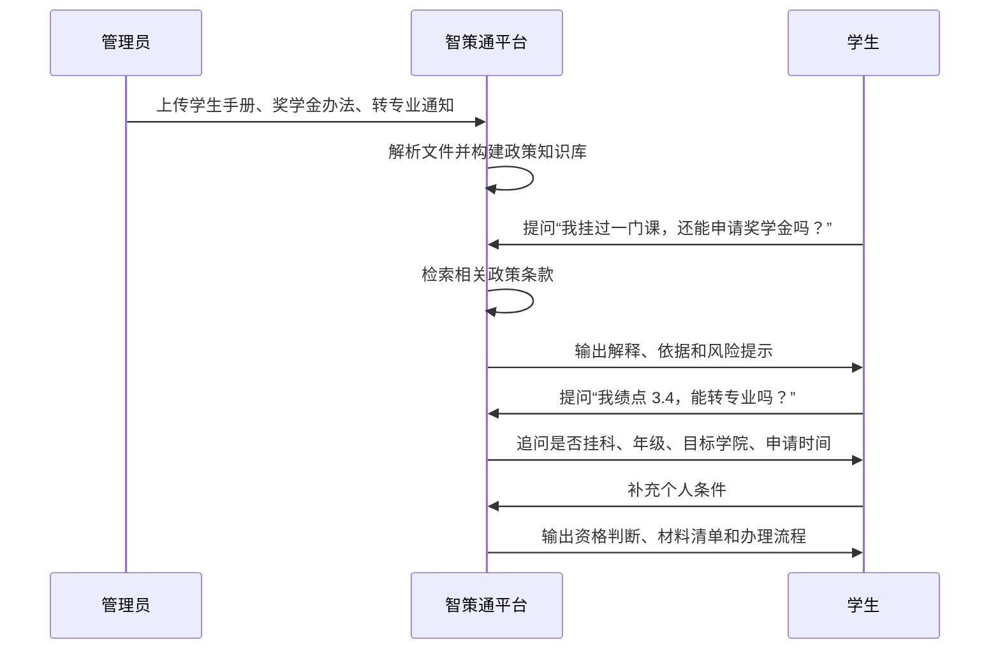
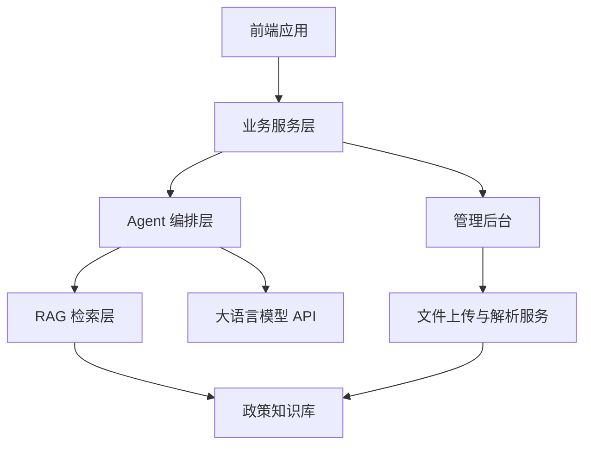

# 智策通：面向多域政策服务场景的智能体化政策理解与精准服务平台

## 一、文档说明

当前已有两份文档：

| 文档 | 主要用途 | 内容特点 |
|---|---|---|
| 《智策通_项目汇总.md》 | 面向申报书、路演、评委理解 | 更宏观，强调项目背景、社会价值、技术路线、应用场景和创新点 |
| 《智策通_产品需求梳理.md》 | 面向产品设计、Demo 开发、功能拆解 | 更具体，强调 V1.0 范围、用户入口、功能需求、演示闭环和待确认问题 |

本文件是两份文档的汇总整合版，作为后续项目推进的主文档使用。

本文件同时承担三个作用：

1. **参赛总方案**：用于梳理项目价值、创新点、应用场景和评委表达。
2. **产品需求文档**：用于明确 V1.0 Demo 的用户、功能、边界和流程。
3. **开发路线依据**：用于后续拆分前端、后端、RAG、Agent 和管理后台任务。

## 二、项目定位

### 2.1 项目名称

**智策通：面向多域政策服务场景的智能体化政策理解与精准服务平台**

### 2.2 一句话定义

> 智策通是一个让政策从“文件”变成“服务”的智能体平台。

### 2.3 产品定位

智策通不是普通的政策搜索工具，也不是简单的政策问答机器人，而是一个基于大语言模型、RAG 和多智能体协同的政策理解、资格判断与办事路径生成平台。

它希望解决的问题不是单纯“政策在哪里”，而是：

- 用户能不能快速找到相关政策？
- 用户能不能看懂政策？
- 用户能不能判断自己是否符合条件？
- 用户能不能知道下一步该准备什么、找谁办理、如何办理？

因此，本项目的核心能力可以概括为：

> 政策理解、政策匹配、资格判断、流程生成、可信溯源。

## 三、参赛目标

### 3.1 比赛定位

本项目面向研究生创新产品技术应用类比赛，目标是冲击国家级奖项。

项目需要同时体现：

1. **技术创新**
   体现大语言模型、RAG、多智能体协同、政策知识库、条件推理、可信溯源等技术能力。

2. **社会价值**
   降低普通用户理解政策、使用政策和办理事项的门槛。

3. **政务价值**
   提高政策服务效率，减少重复咨询，推动政策精准触达。

4. **商业价值**
   未来可面向高校、园区、企业服务机构、政务大厅等组织提供平台化服务。

5. **落地能力**
   比赛阶段至少要有一个可运行 Demo，不能只停留在概念方案。

### 3.2 成果形态

比赛阶段建议形成以下成果：

- 一套完整产品方案
- 一个可运行 Web Demo
- 一份项目申报书或商业计划书
- 一套路演 PPT
- 一份技术架构说明
- 若时间允许，可补充论文式研究说明

## 四、总体策略：一核四域

项目采用“一核四域”的落地策略。

### 4.1 一核

**高校政策智能服务**是 V1.0 的首个落地样板。

高校场景适合先做的原因：

- 政策文件相对容易获取
- 学生痛点真实且高频
- 演示案例清晰
- 数据规模可控
- 用户角色完整，包括学生、辅导员、教务老师和管理人员
- 后续可自然扩展到城市、企业和政务服务

### 4.2 四域

| 阶段 | 领域 | 典型政策 | 主要用户 |
|---|---|---|---|
| V1.0 | 高校政策 | 奖学金、助学金、转专业、保研、毕业、请假、处分、学籍管理 | 学生、辅导员、教务处、学生处 |
| V2.0 | 城市青年政策 | 人才补贴、租房补贴、落户政策、创业扶持 | 高校毕业生、青年人才、创业青年 |
| V3.0 | 企业政策 | 税收优惠、项目申报、政府补贴、资质认定 | 中小企业、科技企业、园区企业 |
| V4.0 | 政务服务 | 政策答疑、材料审核、流程指引、政策触达 | 政务大厅、热线人员、基层工作人员 |

整体扩展路径：

## 五、项目背景与痛点

当前政策服务普遍存在以下问题：

1. **政策文件分散**
   政策常分布在政府网站、高校官网、通知公告、PDF、Word 附件和办事指南中，用户难以系统获取。

2. **政策表达复杂**
   政策文本通常具有行政化、规范化和条文化特征，普通用户理解成本高。

3. **适用条件难判断**
   用户真正关心的是“我能不能申请”“我符不符合条件”，而不只是阅读政策原文。

4. **办理路径不清晰**
   用户即使理解政策，也常常不知道需要准备哪些材料、找哪个部门、什么时候提交、线上还是线下办理。

5. **政策更新难追踪**
   政策可能存在新旧版本、补充通知、解释说明和地区差异，用户容易引用过期信息。

6. **服务人员重复答疑压力大**
   高校辅导员、教务处、学生处、政务窗口和企业服务专员经常面对大量重复性咨询。

因此，政策服务的关键不只是“让用户查到政策”，而是让政策能够被理解、被匹配、被判断、被执行。

## 六、核心概念：精准服务

本项目中的“精准服务”指：

> 基于用户身份、用户条件、政策知识库和智能体推理能力，为用户提供与其个人情况或组织情况高度匹配的政策解释、适用性判断和办事路径推荐。

精准服务包括四个层面：

1. **精准识别用户身份**
   判断用户是学生、辅导员、企业负责人、青年人才还是政务工作人员，不同身份匹配不同政策范围和表达方式。

2. **精准匹配相关政策**
   根据用户输入的年龄、学历、户籍、社保、成绩、企业类型、项目方向等条件筛选相关政策。

3. **精准判断适用条件**
   分析用户当前条件与政策要求之间的匹配关系，判断“已满足”“未满足”“需补充确认”。

4. **精准生成办理路径**
   将政策条款转化为材料清单、办理步骤、时间节点、负责部门和风险提示。

## 七、目标用户

### 7.1 V1.0 用户分层

| 用户类型 | 阶段定位 | 核心需求 |
|---|---|---|
| 学生 | 第一核心用户 | 找政策、理解政策、判断自己是否符合条件、知道怎么办理 |
| 辅导员 | 第二核心用户 | 减少重复答疑，快速查询政策依据 |
| 教务老师 | 第二核心用户 | 辅助解释学籍、转专业、毕业等政策 |
| 学生处/管理人员 | 管理端用户 | 上传政策、维护知识库、查看热点问题 |

### 7.2 后续扩展用户

| 用户类型 | 对应阶段 | 核心需求 |
|---|---|---|
| 青年人才 | V2.0 | 人才补贴、租房补贴、落户政策匹配 |
| 企业负责人 | V3.0 | 税收优惠、项目申报、补贴政策匹配 |
| 政务服务用户 | V4.0 | 政策咨询、材料准备、办事流程指引 |
| 政务工作人员 | V4.0 | 快速答疑、材料审核、咨询分流 |

## 八、V1.0 场景范围

### 8.1 首个落地场景

V1.0 建议聚焦西安电子科技大学高校政策服务。

首批政策范围：

- 奖学金
- 助学金
- 转专业
- 保研
- 毕业要求
- 请假
- 处分
- 学籍管理

### 8.2 数据来源

第一阶段先使用手动上传方式，不优先开发自动爬虫。

建议优先导入：

- 学校学生手册
- 奖学金评定办法
- 助学金相关规定
- 转专业通知
- 保研政策
- 毕业要求文件
- 学籍管理办法
- 请假与处分相关文件

后续版本再考虑自动爬取学校官网、教务处网站、学生处网站和通知公告。

## 九、产品形态设计

### 9.1 首页定位

首页不建议只做一个聊天框。单纯聊天框容易被评委理解为普通 ChatGPT 套壳，产品辨识度不够。

建议首页设计为：

> 政策服务工作台

首页核心表达：

> 说出你的情况，智策通帮你找到政策依据、判断适用条件、生成办理路径。

### 9.2 首页核心入口

| 入口 | 面向问题 | 示例 |
|---|---|---|
| 我要问政策 | 用户想理解某个政策 | “挂科还能申请奖学金吗？” |
| 我要判断资格 | 用户想知道自己能不能办 | “我绩点 3.4，可以转专业吗？” |
| 我要办理事项 | 用户想按事项查看流程 | 奖学金、转专业、保研、毕业、请假 |
| 管理入口 | 管理员维护政策知识库 | 上传文件、查看热门问题、维护标准答案 |

### 9.3 推荐首屏结构

首屏建议包括：

- 顶部导航：智策通、政策库、事项中心、管理后台
- 中央主入口：自然语言输入框
- 快捷事项卡片：奖学金、助学金、转专业、保研、毕业、请假、处分、学籍
- 智能服务按钮：问政策、判资格、列材料、走流程
- 可信说明：回答基于已上传政策文件，并提供出处引用

## 十、核心功能

### 10.1 政策文件上传与解析

支持管理员上传 PDF、Word 等政策文件，系统自动进行文本抽取、章节识别、条款切分、元数据标注和入库。

关键能力：

- 文件上传
- 文本抽取
- 章节识别
- 条款切分
- 元数据提取
- 向量化入库
- 解析状态展示

### 10.2 政策智能问答

用户可以用自然语言提问，系统基于政策知识库回答，并提供依据。

示例问题：

- 我挂过科还能申请奖学金吗？
- 转专业需要满足哪些成绩要求？
- 毕业学分不够怎么办？
- 请假超过几天需要学院审批？

回答结构建议：

- 简要结论
- 通俗解释
- 政策依据
- 适用条件
- 风险提示
- 后续建议

### 10.3 资格判断

系统根据用户的个人条件判断是否符合政策要求。

当用户信息不足时，Agent 主动追问：

- 你目前是大几？
- 绩点是多少？
- 是否有挂科？
- 是否有处分记录？
- 是否在申请时间范围内？
- 目标学院或专业是否有额外要求？

输出结果：

- 符合条件项
- 不符合条件项
- 待确认条件
- 综合判断
- 替代建议

### 10.4 材料清单与办理流程生成

系统根据政策文件整理用户下一步需要做什么。

输出内容：

- 办理事项名称
- 申请条件
- 所需材料
- 办理入口
- 负责部门
- 截止时间
- 审核流程
- 常见错误提醒

### 10.5 政策对比与更新提醒

后续版本支持对新旧政策进行智能对比。

可识别变化：

- 申请条件变化
- 补贴金额变化
- 材料要求变化
- 申报时间变化
- 负责部门变化

### 10.6 管理后台

管理后台用于体现项目的落地性和可运营性。

必须支持：

- 政策文件上传
- 政策文件管理
- 解析状态查看
- 知识库构建
- 热门问题查看
- 标准答案维护

建议支持：

- 政策版本管理
- 文件发布部门维护
- 生效时间与失效时间维护
- 高风险问题人工审核

## 十一、V1.0 MVP 功能清单

比赛阶段建议优先完成以下能力：

1. PDF/Word 政策文件上传。
2. 文档解析并入库。
3. 基于 RAG 的政策问答。
4. 回答附带文件名和政策出处。
5. 用户条件追问。
6. 资格判断：符合、不符合、需补充确认。
7. 材料清单与办理流程生成。
8. 管理端上传文件与查看政策列表。
9. 热门问题统计。
10. 标准答案维护。

第一阶段可以暂缓：

- 自动爬取西电官网政策。
- 多城市政策全覆盖。
- 企业政策复杂匹配。
- 政务大厅真实系统对接。
- 复杂账号权限体系。

## 十二、MVP 演示闭环

比赛 Demo 应优先展示一个完整闭环，而不是展示大量分散功能。

### 12.1 推荐演示链路

### 12.2 推荐演示案例

案例一：奖学金政策问答

- 用户问题：我挂过一门课，还能申请奖学金吗？
- 展示能力：政策检索、通俗解释、出处引用、风险提示。

案例二：转专业资格判断

- 用户问题：我大一绩点 3.4，想转计算机专业，可以吗？
- 展示能力：主动追问、条件判断、适用性分析、流程生成。

案例三：管理员上传政策

- 管理员操作：上传学生手册、奖学金评定办法、转专业通知。
- 展示能力：文件解析、知识库构建、政策文件管理、热门问题统计。

## 十三、智能体架构

智策通可采用多智能体协同架构，将复杂政策服务流程拆解为多个专业 Agent。

| 智能体 | 职责 |
|---|---|
| 政策解析 Agent | 解析政策文件，提取结构化条款和元数据 |
| 语义检索 Agent | 根据用户问题检索相关政策条款 |
| 政策解释 Agent | 将正式政策语言转化为通俗表达 |
| 条件追问 Agent | 识别缺失条件并主动提问 |
| 资格判断 Agent | 根据用户画像判断政策适用性 |
| 流程规划 Agent | 生成办理步骤、材料清单和时间节点 |
| 风险校验 Agent | 检查回答是否有政策依据，降低幻觉风险 |
| 服务推荐 Agent | 推荐相关政策、替代政策或下一步服务 |

整体流程：

## 十四、技术路线

### 14.1 技术架构

### 14.2 数据层

- 政策文件库
- 条款知识库
- 用户画像数据
- 办事流程数据
- 历史问答数据

### 14.3 模型层

- 大语言模型
- 向量检索模型
- 文档解析模型
- 信息抽取模型
- 多智能体协同框架

### 14.4 服务层

- 政策问答服务
- 政策匹配服务
- 条件判断服务
- 流程生成服务
- 政策对比服务
- 风险校验服务

### 14.5 应用层

- 学生端
- 辅导员/教务老师辅助端
- 管理后台
- 政策库
- 数据分析看板

## 十五、可信机制与风险控制

政策服务具有较高严肃性，因此必须建立可信机制。

### 15.1 回答原则

1. 优先基于已上传政策文件回答。
2. 回答中尽量附带政策来源。
3. 可以进行有限推断，但必须明确区分“政策原文依据”和“AI 推断建议”。
4. 信息不足时，不直接下绝对结论。
5. 对高风险事项提示以学校或主管部门最终解释为准。

### 15.2 不确定问题兜底策略

当系统无法确定答案时，应明确告知：

> 根据当前已上传政策文件，暂未检索到能够直接确认该问题的明确条款。以下是基于相关政策内容的推断，建议你进一步咨询对应负责部门确认。

输出结构建议：

- 已知依据
- 无法确定的原因
- AI 推断
- 建议咨询部门
- 需要补充的信息

### 15.3 权威性设计

系统应尽量展示：

- 文件名称
- 发布部门
- 发布日期
- 生效时间
- 条款编号
- 原文片段
- 文件版本

### 15.4 风险控制

关键设计：

- 答案可溯源
- 政策版本管理
- 高风险事项人工审核
- 模型幻觉控制
- 用户隐私保护
- 权限控制

## 十六、创新点

### 16.1 从政策检索到政策服务

传统系统主要解决“查得到”的问题，智策通进一步解决“看得懂、判得准、办得了”的问题。

### 16.2 从通用问答到个性化适配

系统不是输出统一答案，而是结合用户身份和具体条件进行个性化判断。

### 16.3 从单模型问答到多智能体协同

项目通过多个专业 Agent 分工协作，提高政策解析、检索、判断、规划和校验能力。

### 16.4 从文本解释到行动规划

系统不仅解释政策含义，还能生成材料清单、办理路径和时间提醒。

### 16.5 从被动咨询到主动推荐

系统可以根据用户画像主动推荐相关政策，实现政策精准触达。

## 十七、评委视角下的项目价值

### 17.1 社会价值

降低政策理解门槛，提升公共政策服务的公平性、可及性和便利性。

### 17.2 管理价值

减少重复性咨询，提高高校、政府和企业服务部门的工作效率。

### 17.3 技术价值

综合应用大语言模型、RAG、多智能体协同、知识库构建、文档解析和可信问答技术。

### 17.4 推广价值

项目可从高校场景起步，逐步扩展至城市青年服务、企业政策服务和政务服务场景，具有较强复制性。

### 17.5 商业价值

未来可形成面向高校、园区、企业服务机构和政务服务部门的 SaaS 平台、私有化部署或行业解决方案。

## 十八、版本规划

### 18.1 V1.0：高校政策 Demo

目标：

> 做出一个完整、可运行、可演示的高校政策智能助手。

范围：

- 手动上传西电政策文件
- 构建 RAG 知识库
- 支持政策问答
- 支持出处引用
- 支持资格判断
- 支持材料清单与流程生成
- 支持基础管理后台

### 18.2 V1.5：高校管理增强

范围：

- 热门问题看板
- 标准答案维护
- 政策版本管理
- 高风险问题人工审核
- 辅导员/教务老师辅助查询入口

### 18.3 V2.0：城市青年政策

范围：

- 人才补贴
- 租房补贴
- 落户政策
- 创业扶持
- 就业见习

### 18.4 V3.0：企业政策服务

范围：

- 税收优惠
- 科技项目申报
- 政府补贴
- 资质认定
- 园区政策匹配

### 18.5 V4.0：政务服务协同

范围：

- 政务大厅政策答疑
- 热线辅助问答
- 材料清单生成
- 办事流程指引
- 政策触达与咨询分流

## 十九、比赛表达建议

### 19.1 项目叙事

建议使用以下叙事：

> 政策并不是没有公开，而是普通用户难以理解、难以判断、难以办理。智策通以高校政策服务为首个验证场景，通过大语言模型、RAG 和多智能体协同，将复杂政策文件转化为可问答、可判断、可办理、可追溯的智能服务。

### 19.2 四个升级

路演中重点强调：

1. 从“政策检索”升级为“政策理解”。
2. 从“通用问答”升级为“个性化资格判断”。
3. 从“文本回答”升级为“办事路径生成”。
4. 从“单一校园工具”升级为“多域政策服务平台”。

### 19.3 推荐金句

> 智策通不是让 AI 代替政策解释权，而是让 AI 帮助用户更高效、更准确地理解官方政策。

> 我们希望让每一份政策文件，都能转化为用户看得懂、用得上、办得成的智能服务。

> 从政策公开到政策可达，从政策可读到政策可用，智策通让政策服务真正走向精准化和智能化。

## 二十、当前待确认问题

进入原型设计和开发前，还需要继续确认：

1. 首批 Demo 使用哪些具体政策文件？
2. 是否只做西安电子科技大学，还是加入一两个其他高校作为对比？
3. V1.0 是否需要用户登录？
4. 是否需要区分学生、辅导员、管理员三类权限？
5. 是否使用真实大模型 API，还是本地模型或模拟接口？
6. 文档解析是否优先支持 PDF，Word 是否放到第二阶段？
7. 答案出处展示到“文件级”即可，还是需要展示到“条款级”？
8. 管理后台是否需要热门问题统计图表？
9. 最终 Demo 是 Web 应用、桌面应用，还是网页原型加后端接口？
10. 比赛提交材料是否需要论文格式、商业计划书格式或系统说明书格式？

## 二十一、近期执行建议

当前阶段最重要的是先把 V1.0 的演示闭环做扎实。

建议优先完成：

1. 收集 3 到 5 份西安电子科技大学政策文件。
2. 明确前端页面：政策服务工作台、问答页、事项页、管理后台。
3. 搭建文件上传与解析流程。
4. 构建 RAG 知识库。
5. 实现政策问答与出处引用。
6. 实现转专业或奖学金场景下的多轮追问。
7. 输出资格判断、材料清单和办理流程。
8. 准备 3 个稳定演示案例。

只要这个闭环能流畅跑通，项目就具备较强的比赛展示价值。

## 二十二、项目总结

智策通以政策理解为入口，以智能体协同为技术路径，以精准服务为核心目标，面向高校、城市青年、企业和政务服务等多类场景，构建一个可复制、可扩展、可信赖的智能政策服务平台。

项目的核心价值不在于简单回答政策问题，而在于帮助用户完成从“提出问题”到“理解政策”再到“判断条件”和“完成办理”的完整服务闭环。

最终愿景：

> 让政策从“人找文件”转向“服务找人”，让复杂政策真正变成每个人可理解、可判断、可执行的智能服务。
