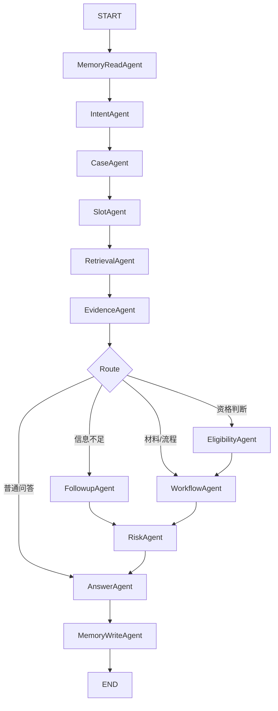

# 智策通 LangGraph 多 Agent 升级需求与开发规划

## 一、文档定位

本文档用于规划智策通 V1.1 的 Agent 架构升级。

当前 V1.0 已经完成：

- Next.js 前端工作台
- FastAPI 后端
- PostgreSQL + pgvector
- LlamaIndex RAG 知识库
- 政策文件上传、解析、切片、检索
- 政策问答与出处引用
- 轻量 Agent 编排
- 短期记忆、事项记忆、长期记忆
- 管理后台、热门问题、标准答案、政策库查看

当前主要问题：

> 代码实现上仍然是一个 `AgentOrchestrator` 串联多个能力函数，并不是真正的多 Agent 编排架构。

本轮升级目标：

> 引入 LangGraph + LangChain，将当前单编排器升级为可控式多 Agent 状态图，并在管理后台展示 Agent 架构、节点职责和运行轨迹。

## 二、当前架构现状

### 2.1 当前 Agent 形态

当前实现是：

```text
AgentOrchestrator
  ├─ 意图识别
  ├─ 事项识别
  ├─ 条件抽取
  ├─ 记忆读取
  ├─ 事项状态同步
  ├─ RAG 检索
  ├─ LLM 问答
  ├─ 资格判断
  ├─ 材料清单生成
  ├─ 办理流程生成
  ├─ 风险校验
  └─ 记忆更新
```

优点：

- 稳定
- 可控
- 易调试
- 适合 V1.0 Demo

不足：

- 不是严格意义上的多 Agent 架构
- 各能力节点没有独立 Agent 抽象
- 缺少统一状态图
- 缺少 Agent 节点级运行日志
- 管理后台无法展示 Agent 架构和执行过程

### 2.2 当前技术分工

当前技术栈保持不变：

| 模块 | 技术 |
|---|---|
| 前端 | Next.js + TypeScript + Tailwind CSS |
| 后端 | FastAPI + Python |
| RAG | LlamaIndex |
| 数据库 | PostgreSQL + pgvector |
| 文档解析 | PyMuPDF + python-docx |
| 当前 Agent | 轻量 Python 编排 |
| 记忆 | PostgreSQL 结构化记忆 |

本轮新增：

| 新增能力 | 技术 |
|---|---|
| 多 Agent 编排 | LangGraph |
| 模型调用与结构化输出 | LangChain |
| Agent 架构可视化 | 管理后台新增页面 |
| Agent 运行轨迹 | PostgreSQL 日志表 |

## 三、升级目标

### 3.1 产品目标

1. **从单 Agent 编排升级为多 Agent 协同**
   将政策服务拆解为多个专业 Agent。

2. **让 Agent 过程可视化**
   管理后台可以看到 Agent 架构、节点职责、运行路径和单次执行详情。

3. **增强比赛表达**
   从普通 RAG 问答系统升级为“可观测、可治理的多智能体政策服务平台”。

4. **保持现有 Demo 稳定**
   升级过程中不破坏现有 `/api/chat`、前端问答页、资格判断页和管理后台。

### 3.2 技术目标

1. 引入 LangGraph 作为状态图编排核心。
2. 引入 LangChain 作为 LLM、Prompt、结构化输出和 Tool 封装层。
3. 保留 LlamaIndex 作为 RAG 知识库与检索框架。
4. 复用当前短期记忆、事项记忆、长期记忆。
5. 复用当前政策检索、资格判断、材料流程和风险校验逻辑。
6. 新增 Agent 节点运行日志和后台可视化接口。

## 四、目标架构

### 4.1 总体架构

```text
用户问题
→ FastAPI /api/chat
→ PolicyMultiAgentGraph
→ LangGraph 多 Agent 状态图
→ LlamaIndex RAG 检索
→ LangChain LLM / Prompt / Structured Output
→ Agent 运行日志入库
→ 返回 ChatResponse
→ 前端展示回答、引用、Agent 状态和风险
```

### 4.2 技术分工

```text
LangGraph：负责多 Agent 状态图和条件路由
LangChain：负责模型调用、Prompt、结构化输出、工具封装
LlamaIndex：负责政策知识库 RAG 检索
PostgreSQL：负责业务数据、记忆、Agent 运行日志
Next.js：负责工作台、问答、资格判断、Agent 架构后台
```

### 4.3 多 Agent 结构

```text
PolicyMultiAgentGraph
  ├─ MemoryReadAgent
  ├─ IntentAgent
  ├─ CaseAgent
  ├─ SlotAgent
  ├─ RetrievalAgent
  ├─ EvidenceAgent
  ├─ FollowupAgent
  ├─ EligibilityAgent
  ├─ WorkflowAgent
  ├─ RiskAgent
  ├─ AnswerAgent
  └─ MemoryWriteAgent
```

## 五、统一状态对象

LangGraph 多 Agent 编排必须围绕统一状态对象运行。

建议定义：

```python
class PolicyAgentState(TypedDict):
    run_id: str
    user_id: str
    session_id: str
    question: str

    intent: str | None
    case_type: str | None
    case_id: str | None

    short_term_memory: dict
    case_memory: dict
    long_term_memory: dict
    recent_messages: list

    extracted_slots: dict
    missing_slots: list

    retrieval_query: str | None
    retrieved_chunks: list
    evidence_summary: dict
    citations: list

    eligibility_result: dict | None
    material_list: list
    workflow_steps: list
    risk: dict | None

    final_answer: str | None
    policy_basis: str | None
    ai_inference: str | None
    memory_updates: list
    execution_trace: list
```

设计原则：

- 所有 Agent 只读写 `PolicyAgentState`。
- Agent 之间不直接互相调用。
- 编排器决定节点顺序和分支。
- 状态对象最终转成现有 `ChatResponse`。

## 六、Agent 职责设计

### 6.1 MemoryReadAgent

职责：

- 读取短期记忆
- 读取事项记忆
- 读取长期记忆
- 读取最近消息窗口

输入：

```text
user_id
session_id
case_id
```

输出：

```text
short_term_memory
case_memory
long_term_memory
recent_messages
```

复用现有能力：

- `read_memory_snapshot()`

### 6.2 IntentAgent

职责：

- 判断用户意图

输出意图：

```text
policy_qa
eligibility_check
workflow_generation
material_list
general_chat
```

复用现有能力：

- `classify_intent()`

后续增强：

- 使用 LangChain structured output 做更稳定的意图分类。

### 6.3 CaseAgent

职责：

- 判断当前政策事项
- 创建或复用 `service_case`
- 识别奖学金、助学金、转专业、保研、毕业、请假、处分、学籍管理等事项

复用现有能力：

- `detect_case_type()`
- `get_current_open_case()`
- `get_or_create_case()`

### 6.4 SlotAgent

职责：

- 从用户输入中抽取条件字段
- 更新事项 slots

示例字段：

```text
grade
gpa
rank_percent
target_major
has_failed_course
has_disciplinary_record
application_period
```

复用现有能力：

- `extract_slots()`
- `sync_case_slots()`

后续增强：

- 使用 LangChain structured output 抽取 JSON。

### 6.5 RetrievalAgent

职责：

- 构造检索 query
- 调用 LlamaIndex RAG 混合检索
- 返回政策 chunk、附件、metadata、分数

复用现有能力：

- `enrich_retrieval_query()`
- `hybrid_search()`

注意：

> RAG 框架继续使用 LlamaIndex，不迁移到 LangChain Retriever。

### 6.6 EvidenceAgent

职责：

- 整理检索结果
- 区分学校政策、部门政策、学院细则、附件材料
- 标记是否有过期政策
- 标记是否存在附件线索
- 标记可能冲突或需要人工确认的问题

输出：

```text
evidence_summary
citations
```

新增能力：

- 当前 V1.0 中证据整理分散在 prompt 和 citation 中，V1.1 建议独立出来。

### 6.7 FollowupAgent

职责：

- 根据缺失 slots 生成追问
- 信息不足时阻止直接下结论

输出：

```text
follow_up_questions
```

复用现有能力：

- `state.missing_slots`
- `case_slots.question`

### 6.8 EligibilityAgent

职责：

- 根据用户条件和政策依据做资格初判

输出：

```text
likely_eligible
pending
not_eligible
matched_conditions
unmet_conditions
pending_conditions
```

复用现有能力：

- `build_eligibility_record()`

### 6.9 WorkflowAgent

职责：

- 生成材料清单
- 生成办理流程
- 指向附件材料

复用现有能力：

- `build_material_list()`
- `build_workflow_steps()`

### 6.10 RiskAgent

职责：

- 校验回答风险
- 判断是否缺政策依据
- 判断是否缺用户条件
- 判断是否命中过期政策
- 判断是否属于高影响事项

输出：

```text
risk_level
warnings
```

复用现有能力：

- `build_risk()`

### 6.11 AnswerAgent

职责：

- 根据政策依据、Agent 结构化结果和风险提示生成最终回答
- 区分“政策依据”和“AI 推断”
- 保持现有前端可展示格式

使用：

- LangChain ChatModel
- PromptTemplate
- Structured Output

### 6.12 MemoryWriteAgent

职责：

- 写入短期记忆
- 写入事项记忆
- 写入长期记忆
- 写入历史咨询记录

复用现有能力：

- `upsert_memory_item()`
- `record_memory_item()`
- `upsert_case_slot()`

## 七、LangGraph 编排设计

### 7.1 主流程图



### 7.2 路由规则

```text
如果 intent = eligibility_check 且 missing_slots 非空：
  → FollowupAgent

如果 intent = eligibility_check 且 missing_slots 为空：
  → EligibilityAgent → WorkflowAgent

如果 intent = workflow_generation：
  → WorkflowAgent

如果 intent = material_list：
  → WorkflowAgent

如果 intent = policy_qa：
  → AnswerAgent

所有分支最终都经过 RiskAgent 和 MemoryWriteAgent。
```

### 7.3 保持兼容

升级后仍然保留：

```text
POST /api/chat
```

返回结构继续兼容：

```text
ChatResponse
  session_id
  question
  answer
  policy_basis
  ai_inference
  citations
  retrieved_chunks
  agent
```

新增字段可以放在：

```text
agent.execution_trace
agent.run_id
```

## 八、后台 Agent 架构可视化

### 8.1 产品目标

管理后台新增一个模块：

> Agent 架构与运行轨迹

作用：

- 展示系统有哪些 Agent。
- 展示 Agent 之间如何流转。
- 展示某次用户提问经过了哪些 Agent。
- 展示每个 Agent 的输入摘要、输出摘要、耗时和状态。

### 8.2 后台页面模块

建议在 `/admin` 增加一个区域，或新增 `/admin/agents` 页面。

页面包括：

1. **Agent 架构图**
   展示节点和边。

2. **Agent 节点表**
   展示每个 Agent 的职责、输入、输出、是否启用。

3. **最近运行记录**
   展示最近的 `agent_runs`。

4. **单次运行详情**
   展示每个节点的执行顺序、状态、耗时和摘要。

### 8.3 架构图展示方案

V1.1 可先使用静态 JSON + 普通卡片/连线展示。

后续可升级：

- React Flow
- Mermaid 渲染
- 节点状态实时高亮

建议第一版不要引入过重前端图引擎，先保证能展示。

### 8.4 后台展示字段

Agent 节点表：

| 字段 | 说明 |
|---|---|
| agent_name | Agent 名称 |
| agent_type | 类型，如 memory、reasoning、retrieval、generation |
| description | 职责说明 |
| input_keys | 输入状态字段 |
| output_keys | 输出状态字段 |
| enabled | 是否启用 |
| average_duration_ms | 平均耗时 |
| failure_count | 失败次数 |

运行记录表：

| 字段 | 说明 |
|---|---|
| run_id | 单次运行 ID |
| session_id | 会话 ID |
| question | 用户问题 |
| intent | 意图 |
| case_type | 事项 |
| status | 状态 |
| risk_level | 风险等级 |
| started_at | 开始时间 |
| duration_ms | 总耗时 |

节点运行详情：

| 字段 | 说明 |
|---|---|
| node_name | 节点名称 |
| status | success / failed / skipped |
| input_summary | 输入摘要 |
| output_summary | 输出摘要 |
| started_at | 开始时间 |
| finished_at | 结束时间 |
| duration_ms | 耗时 |
| error_message | 错误信息 |

## 九、后端接口规划

新增管理接口：

```text
GET /api/management/agent-graph
GET /api/management/agent-nodes
GET /api/management/agent-runs
GET /api/management/agent-runs/{run_id}
```

### 9.1 agent-graph

返回 Agent 架构：

```json
{
  "version": "v1.1-langgraph",
  "nodes": [
    {
      "id": "memory_read",
      "label": "MemoryReadAgent",
      "type": "memory",
      "description": "读取短期、事项和长期记忆"
    }
  ],
  "edges": [
    {
      "source": "memory_read",
      "target": "intent",
      "condition": "always"
    }
  ]
}
```

### 9.2 agent-runs

返回最近运行：

```json
[
  {
    "run_id": "xxx",
    "session_id": "xxx",
    "question": "我能转专业吗？",
    "intent": "eligibility_check",
    "case_type": "major_transfer",
    "status": "success",
    "risk_level": "medium",
    "duration_ms": 1280
  }
]
```

### 9.3 agent-runs/{run_id}

返回单次执行详情：

```json
{
  "run": {},
  "steps": [
    {
      "node_name": "IntentAgent",
      "status": "success",
      "input_summary": "question=我能转专业吗？",
      "output_summary": "intent=eligibility_check",
      "duration_ms": 12
    }
  ]
}
```

## 十、数据库规划

新增表：

```text
agent_graph_versions
agent_nodes
agent_edges
agent_runs
agent_step_logs
```

### 10.1 agent_graph_versions

用途：

- 记录当前 Agent 图版本

字段：

```text
id
version
description
status
created_at
updated_at
```

### 10.2 agent_nodes

用途：

- 记录 Agent 节点定义

字段：

```text
id
graph_version_id
node_key
node_name
node_type
description
input_keys
output_keys
enabled
sort_order
created_at
updated_at
```

### 10.3 agent_edges

用途：

- 记录 Agent 节点之间的流转关系

字段：

```text
id
graph_version_id
source_node_key
target_node_key
condition_label
condition_expression
created_at
updated_at
```

### 10.4 agent_runs

用途：

- 记录一次完整 Agent 图运行

字段：

```text
id
graph_version
user_id
session_id
question
intent
case_type
status
risk_level
started_at
finished_at
duration_ms
error_message
created_at
```

### 10.5 agent_step_logs

用途：

- 记录每个 Agent 节点执行情况

字段：

```text
id
run_id
node_key
node_name
status
input_summary
output_summary
started_at
finished_at
duration_ms
error_message
created_at
```

## 十一、代码目录规划

建议新增目录：

```text
backend/app/services/agent_graph/
  state.py
  graph.py
  runner.py
  routing.py
  logging.py

backend/app/services/agent_graph/agents/
  base.py
  memory_read_agent.py
  intent_agent.py
  case_agent.py
  slot_agent.py
  retrieval_agent.py
  evidence_agent.py
  followup_agent.py
  eligibility_agent.py
  workflow_agent.py
  risk_agent.py
  answer_agent.py
  memory_write_agent.py

backend/app/models/agent_graph.py
backend/app/schemas/agent_graph.py
backend/app/api/routes/agent_graph.py
```

前端建议新增：

```text
frontend/src/app/admin/agents/page.tsx
frontend/src/components/agent-graph/
  agent-node-card.tsx
  agent-run-table.tsx
  agent-step-timeline.tsx
```

也可以先不新增独立页面，先集成到现有 `/admin`。

## 十二、开发任务拆解

### 阶段 A：依赖与基础结构

任务：

1. 安装 LangGraph。
2. 安装 LangChain 核心依赖。
3. 新建 `agent_graph` 服务目录。
4. 定义 `PolicyAgentState`。
5. 定义 Agent 基类。
6. 定义图版本常量和节点配置。

验收标准：

- 后端可以正常导入 LangGraph / LangChain。
- 不影响现有 `/api/chat`。
- `PolicyAgentState` 能表达当前问答所需状态。

### 阶段 B：节点类化

任务：

1. 实现 `MemoryReadAgent`。
2. 实现 `IntentAgent`。
3. 实现 `CaseAgent`。
4. 实现 `SlotAgent`。
5. 实现 `RetrievalAgent`。
6. 实现 `EvidenceAgent`。
7. 实现 `FollowupAgent`。
8. 实现 `EligibilityAgent`。
9. 实现 `WorkflowAgent`。
10. 实现 `RiskAgent`。
11. 实现 `AnswerAgent`。
12. 实现 `MemoryWriteAgent`。

验收标准：

- 每个 Agent 可单独测试。
- 每个 Agent 输入输出清晰。
- 当前旧逻辑被尽量复用。

### 阶段 C：LangGraph 状态图

任务：

1. 创建 `PolicyMultiAgentGraph`。
2. 注册所有 Agent 节点。
3. 实现条件路由。
4. 接入 `/api/chat`。
5. 保持原 `ChatResponse` 兼容。
6. 保留旧 `AgentOrchestrator` 作为 fallback。

验收标准：

- `/api/chat` 仍能完成原有问答。
- 转专业资格判断能完成追问。
- 奖学金问答能返回政策依据和引用。
- Agent 图能根据意图走不同分支。

### 阶段 D：运行日志

任务：

1. 新增 Agent 图相关数据库模型。
2. 新增建表或迁移逻辑。
3. 每次 `/api/chat` 创建 `agent_run`。
4. 每个节点执行前后写入 `agent_step_logs`。
5. 节点失败时保存错误信息。
6. 运行完成后写入总耗时、状态和风险等级。

验收标准：

- 每次问答都有 `run_id`。
- 后台可以查到运行记录。
- 每个 Agent 节点有执行日志。

### 阶段 E：管理后台接口

任务：

1. 实现 `GET /api/management/agent-graph`。
2. 实现 `GET /api/management/agent-nodes`。
3. 实现 `GET /api/management/agent-runs`。
4. 实现 `GET /api/management/agent-runs/{run_id}`。
5. 在 dashboard 中增加 Agent 运行指标。

验收标准：

- 后端能返回 Agent 图结构。
- 后端能返回最近运行记录。
- 后端能返回单次运行详情。

### 阶段 F：管理后台可视化

任务：

1. 新增 Agent 架构模块。
2. 展示 Agent 节点卡片。
3. 展示 Agent 边关系。
4. 展示最近运行记录。
5. 展示单次运行时间线。
6. 展示节点耗时、状态和输出摘要。

验收标准：

- 管理员能看到多 Agent 架构。
- 管理员能看到某次问答经过哪些 Agent。
- 页面能用于比赛讲解。

### 阶段 G：测试与演示

任务：

1. 编写 Agent 单元测试。
2. 编写 LangGraph 冒烟测试。
3. 编写 `/api/chat` 回归测试。
4. 编写 Agent 运行日志测试。
5. 准备三条演示问题：
   - 奖学金问答
   - 转专业资格判断
   - 毕业材料/流程咨询
6. 准备后台 Agent 架构展示脚本。

验收标准：

- 原有 Demo 不退化。
- Agent 架构后台可展示。
- 每条演示问题都有完整运行轨迹。

## 十三、优先级建议

### P0 必须完成

1. 引入 LangGraph / LangChain。
2. 定义统一 `PolicyAgentState`。
3. 将现有流程迁移到 LangGraph 状态图。
4. 保持 `/api/chat` 兼容。
5. 管理后台能看到静态 Agent 架构图。

### P1 强烈建议完成

1. Agent 运行日志入库。
2. 后台展示最近运行记录。
3. 后台展示单次运行详情。
4. `run_id` 返回到 `ChatResponse.agent`。
5. Agent 节点耗时统计。

### P2 后续增强

1. LangChain structured output 替换部分规则抽取。
2. React Flow 可视化 Agent 图。
3. Agent 节点启停配置。
4. Agent prompt 在线编辑。
5. LangGraph checkpoint 持久化。
6. LangSmith 或类似工具接入。

## 十四、验收标准

### 功能验收

1. `/api/chat` 正常返回政策回答。
2. 奖学金问题能返回政策依据和引用。
3. 转专业问题能识别资格判断意图并追问缺失条件。
4. 材料/流程问题能生成材料线索和办理步骤。
5. 风险校验仍然有效。
6. 短期记忆、事项记忆、长期记忆仍然正常写入。

### 架构验收

1. 后端存在 LangGraph 状态图。
2. 每个 Agent 有独立类或独立节点函数。
3. Agent 节点通过统一 state 传递信息。
4. 条件路由清晰。
5. LlamaIndex RAG 未被破坏。

### 后台验收

1. 管理后台能看到 Agent 架构。
2. 管理后台能看到 Agent 节点说明。
3. 管理后台能看到最近运行记录。
4. 管理后台能看到单次运行详情。
5. 每个运行步骤有状态和耗时。

### 演示验收

路演时可以讲清：

```text
用户提问
→ 多 Agent 状态图协同
→ 检索政策依据
→ 判断用户条件
→ 生成办事路径
→ 风险校验
→ 后台可观测 Agent 全流程
```

## 十五、风险与控制

### 风险一：多 Agent 引入后流程变慢

控制：

- 首版多数 Agent 使用规则和现有函数。
- 不是每个 Agent 都调用 LLM。
- 只有 AnswerAgent 必须调用 LLM。
- IntentAgent / SlotAgent 后续再按需升级 structured output。

### 风险二：破坏现有 Demo

控制：

- 保留旧 `AgentOrchestrator` 作为 fallback。
- `/api/chat` 返回结构保持兼容。
- 先包壳，再拆功能。

### 风险三：Agent 日志过大

控制：

- 只保存摘要，不保存完整 prompt。
- 检索 chunk 只保存数量和标题摘要。
- 高敏内容后续做脱敏。

### 风险四：后台架构图实现过重

控制：

- V1.1 先用卡片和简单连线。
- 后续再接 React Flow。

## 十六、推荐开发顺序

```text
1. 增加 LangGraph / LangChain 依赖
2. 定义 PolicyAgentState
3. 新建 agent_graph 目录
4. 把现有 prepare/finalize 拆为 Agent 节点
5. 构建 LangGraph 状态图
6. 接入 /api/chat
7. 跑通奖学金问答
8. 跑通转专业资格判断
9. 新增 agent_runs / agent_step_logs
10. 增加管理后台 Agent 图接口
11. 前端后台展示 Agent 架构
12. 前端后台展示运行轨迹
13. 回归测试 M5/M6/M7/M8
14. 准备比赛演示脚本
```

## 十七、比赛表达建议

升级后可以这样表达：

> 智策通 V1.1 引入基于 LangGraph 的可控式多智能体编排架构，将政策服务拆解为记忆读取、意图识别、事项建模、政策检索、证据整理、条件追问、资格判断、流程规划、风险校验、答案生成和记忆更新等多个专业 Agent。系统通过统一状态对象驱动各 Agent 协作，并将 Agent 架构、节点状态和运行轨迹接入管理后台，实现政策智能服务过程的可观测、可解释和可治理。

答辩关键词：

- 可控式多智能体
- 状态图编排
- 政策 RAG
- 条件追问
- 资格判断
- 流程规划
- 风险校验
- Agent 可观测
- 智能体治理

## 十八、最终结论

本轮升级不是为了简单堆叠多个 Agent 名称，而是要把当前已经稳定的 V1.0 能力升级为：

> **基于 LangGraph 的可控式多 Agent 政策服务系统。**

推荐实施策略：

```text
先包壳，后拆分；
先兼容，后增强；
先可运行，后可视化；
先可观测，后智能化。
```

只要完成 LangGraph 状态图、Agent 运行日志和后台架构展示，智策通的技术表达会从“RAG + 轻量 Agent”明显升级为“可治理的多智能体政策服务平台”。

## 十九、当前实现状态与后续任务规划（2026-05-24）

本节用于记录 LangGraph 多 Agent 升级在当前代码库中的真实落地状态，并作为后续迭代的任务入口。后续每次推进本规划时，必须同步更新 `目录.md`，保持项目导航文档的渐进式披露能力。

### 19.1 当前已完成状态

当前 V1.1 LangGraph 多 Agent 升级已经通过 PR #1 合入远端 `main`，合并提交为：

```text
573f95e Merge pull request #1 from Davidlaizz/codex/langgraph-multi-agent-upgrade
```

已经完成的核心能力包括：

1. 后端已引入 `LangGraph + LangChain Core`。
2. 已新增 `backend/app/services/agent_graph/` 服务目录。
3. 已定义统一状态对象 `PolicyAgentState`。
4. 已实现 12 个 Agent 节点：记忆读取、意图识别、事项识别、槽位抽取、RAG 检索、证据整理、追问、资格判断、流程材料、风险校验、答案生成、记忆写入。
5. `/api/chat` 已接入 LangGraph 多 Agent 状态图，并保持原 `ChatResponse` 兼容。
6. 已新增 Agent 运行记录模型和日志模型。
7. 已新增 Agent 图、节点、运行记录和运行详情管理接口。
8. 管理后台 `/admin` 已新增“Agent 架构与运行轨迹”模块。
9. 后台已支持查看 Agent 节点、条件路由、最近运行记录和单次运行步骤。
10. 已修正依赖版本：`langchain-core==1.2.17`、`langgraph==1.0.8`。
11. 已在 `目录.md` 中记录 pip 代理、国内镜像和 Git 提交规范注意事项。

### 19.2 当前完成度判断

| 阶段 | 内容 | 状态 | 说明 |
|---|---|---|---|
| 阶段 A | 依赖与基础结构 | 已完成 | LangGraph、LangChain Core、状态对象、配置常量已落地 |
| 阶段 B | 节点类化 | 已完成 | 12 个 Agent 节点已实现，复用现有规则和服务 |
| 阶段 C | LangGraph 状态图 | 已完成 | `/api/chat` 已接入多 Agent 图 |
| 阶段 D | 运行日志 | 已完成 | 已写入 `agent_runs` 和 `agent_step_logs` |
| 阶段 E | 管理后台接口 | 已完成 | Agent 图、节点、运行记录和详情接口已实现 |
| 阶段 F | 管理后台可视化 | 已完成第一版 | 已集成到 `/admin`，暂未使用 React Flow |
| 阶段 G | 测试与演示 | 已完成第一版 | 已完成烟测、三条演示问题、运行轨迹记录和路演讲解脚本 |

### 19.3 下一轮 P0 任务：V1.1 验收与演示固化

目标：把已经完成的多 Agent 能力整理成稳定、可复现、适合参赛路演的展示闭环。

当前状态：已完成第一版，详见 [docs/v1.1-langgraph-demo-acceptance.md](D:\woskspace\AgentHelper\docs\v1.1-langgraph-demo-acceptance.md)。

任务：

1. 同步本地 `main` 到远端最新状态。
2. 基于 `main` 跑完整后端烟测：`python -m pip check`、`python -m compileall app`、`m6_smoke_test.py`、`m7_smoke_test.py`。
3. 基于 `main` 跑前端检查：`npm run lint`、`npm run build`。
4. 准备 3 条稳定演示问题：奖学金政策问答、转专业资格判断、毕业要求或材料流程咨询。
5. 为每条演示问题记录用户问题、命中的政策文件、Agent 运行路径、最终回答摘要、后台运行记录截图或说明。
6. 整理一份“多 Agent 演示讲解脚本”，突出可观测、可追踪、可治理、有出处、能追问、能生成流程和材料。

验收标准：

1. 三条演示问题均能稳定返回结果。
2. 每次问答均生成 `run_id`。
3. 管理后台可以看到对应运行轨迹。
4. 讲解时能清楚说明每个 Agent 的职责和流转路径。

已完成验收记录：

1. `python -m pip check` 通过。
2. `python -m compileall app` 通过。
3. `m6_smoke_test.py` 通过。
4. `m7_smoke_test.py` 通过。
5. `npm run lint` 通过。
6. `npm run build` 通过。
7. 奖学金、转专业、毕业流程三条演示问题均生成完整 Agent 运行轨迹。

### 19.4 P1 任务：Agent 智能化增强

目标：从“规则复用型多 Agent”升级为“部分结构化智能 Agent”。

当前状态：已完成第一版，详见 [docs/v1.1-langgraph-p1-p2-completion.md](D:\woskspace\AgentHelper\docs\v1.1-langgraph-p1-p2-completion.md)。

任务：

1. 使用 LangChain structured output 增强 `IntentAgent`。（已完成第一版）
2. 使用 LangChain structured output 增强 `SlotAgent`。（已完成第一版）
3. 为 `EvidenceAgent` 增加更清晰的证据分层：学校通用政策、学院细则、年度通知、附件材料、已过期政策。（已完成第一版）
4. 为 `RiskAgent` 增加冲突检测规则：学校政策与学院政策冲突、正文与附件不一致、新旧版本政策冲突、缺少生效时间。（已完成缺少生效时间、过期政策、学校/学院层级混合、附件证据提示第一版）
5. 增加 Agent 输出结构校验，避免某个节点返回不完整状态。（已完成第一版）
6. 梳理 `AnswerAgent` prompt，使其更明确地区分政策原文依据、用户条件判断、AI 推断、不确定事项和下一步建议。（已完成第一版）

验收标准：

1. 意图识别和槽位抽取比当前规则更稳定。
2. 回答中的政策依据、AI 推断和风险提示边界更清晰。
3. 对附件、学院细则、有效期的解释能力增强。

已完成验收记录：

1. `EvidenceAgent` 已输出 `school_level_titles`、`college_level_titles`、`annual_notice_titles`、`attachment_titles`、`missing_effective_date_titles`、`expired_titles` 等结构化字段。
2. `RiskAgent` 已基于证据摘要补充有效期、过期政策、学校/学院层级混合和附件证据风险提示。
3. `AgentResponse` 已暴露 `evidence_summary`。
4. 问答页 Agent 面板已展示“证据分层”。
5. `IntentAgent` 和 `SlotAgent` 已引入 LangChain `PydanticOutputParser`，支持 structured output 和规则兜底。
6. Agent 节点 wrapper 已增加输出字段校验。
7. `python -m compileall app`、`m6_smoke_test.py`、`m7_smoke_test.py`、`npm run lint`、`npm run build` 均通过。

### 19.5 P2 任务：后台可视化与治理能力

目标：让管理后台更像“智能体治理平台”，提升比赛表达力。

当前状态：已完成第一版，详见 [docs/v1.1-langgraph-p1-p2-completion.md](D:\woskspace\AgentHelper\docs\v1.1-langgraph-p1-p2-completion.md)。

任务：

1. 将当前卡片式 Agent 图升级为更直观的流程图。（已完成第一版）
2. 可选技术：第一阶段 Mermaid 静态图，第二阶段 React Flow 交互图。（已采用轻量前端状态图第一版）
3. 增加单次运行详情弹窗或独立页面。（已完成运行详情面板第一版）
4. 增加 Agent 节点统计：调用次数、平均耗时、失败次数、最近失败原因。（已完成第一版）
5. 增加 Agent 配置展示：节点是否启用、节点类型、输入字段、输出字段。（已完成第一版）
6. 后续可扩展为在线配置：节点启停、Prompt 编辑、路由规则说明、日志保留周期。

验收标准：

1. 管理后台能承担路演中的“技术架构展示页”作用。
2. 非技术评委能看懂系统为什么不是普通 RAG 问答。
3. 技术评委能看到 Agent 状态图、运行日志和治理闭环。

已完成验收记录：

1. `/admin` 已展示多 Agent 状态图、条件路由、最近运行和运行详情。
2. 节点卡片和节点治理统计表已展示调用次数、平均耗时、失败次数、输入字段、输出字段。
3. 后端管理接口已返回 `call_count`、`last_failure_message`、`last_failure_at` 等治理字段。
4. `npm run lint` 和 `npm run build` 均通过。

### 19.6 下一轮 P3 任务：多场景扩展准备

目标：为后续从高校政策扩展到城市青年政策、企业政策、政府服务政策做架构准备。

任务：

1. 抽象政策域 `policy_domain`：`campus`、`city_youth`、`enterprise`、`government_service`。
2. 抽象事项类型 `case_type` 的跨域映射。
3. 抽象用户角色：学生、辅导员、教务老师、青年人才、企业负责人、政务窗口人员。
4. 扩展 metadata：地区、部门、政策对象、申报周期、补贴金额、办理入口。
5. 为城市青年政策准备一个最小样例集：人才补贴、租房补贴、创业扶持、落户政策。

验收标准：

1. 不破坏高校政策 Demo。
2. 新增政策域不需要重写 Agent 主流程。
3. RAG metadata 可以支持跨域过滤。
4. 后台可以按政策域查看文档和运行情况。

### 19.7 后续推荐实施顺序

```text
1. 同步 main 并完成 V1.1 验收测试
2. 整理三条稳定演示问题和运行轨迹
3. 编写多 Agent 路演讲解脚本
4. 增强 IntentAgent / SlotAgent structured output
5. 增强 EvidenceAgent 政策分层和附件识别
6. 增强 RiskAgent 政策冲突与有效期校验
7. 升级后台 Agent 可视化
8. 准备城市青年政策最小扩展示例
9. 整理参赛技术创新点和产品价值表达
```

### 19.8 当前不建议立即做的事项

1. 不建议马上引入复杂的多模型协作，当前 Demo 稳定性优先。
2. 不建议马上做自动爬虫，手动上传政策文件更适合参赛演示。
3. 不建议马上做扫描件 OCR，容易引入不可控解析误差。
4. 不建议马上做多租户权限系统，当前先保证高校版闭环。
5. 不建议马上重写 RAG，LlamaIndex 当前仍然是知识库主框架。

### 19.9 当前阶段结论

智策通已经从 V1.0 的“RAG + 轻量 Agent 政策问答 Demo”，升级到了 V1.1 的“基于 LangGraph 的可观测多 Agent 政策服务平台”。

下一阶段的重点不再是证明“能不能跑”，而是证明：

1. 能稳定演示。
2. 能解释清楚。
3. 能让评委看到技术创新。
4. 能体现政策服务价值。
5. 能为多场景扩展留下空间。
